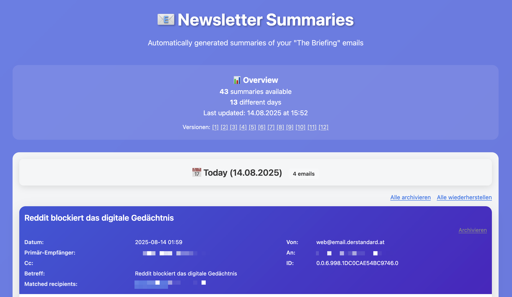
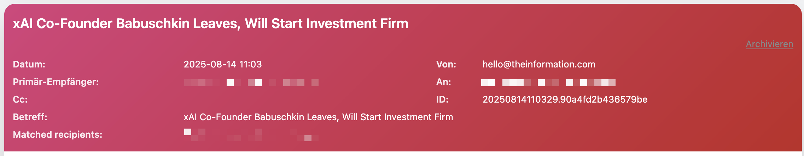
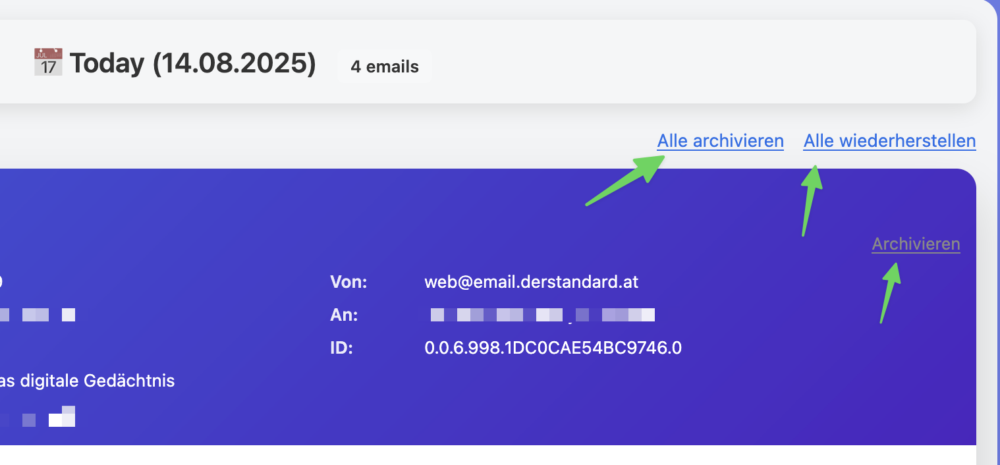
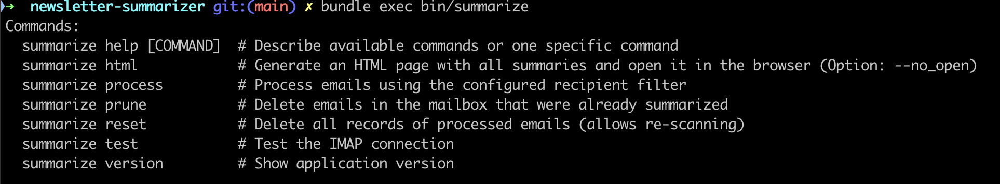

# Newsletter Summarizer

A Ruby application that automatically reads emails from an IMAP mailbox, generates summaries with OpenAI, and saves them as Markdown files. It also generates an HTML page with all summaries and opens it in your browser.

## Features

- 📧 IMAP email processing
- 🤖 AI-powered summaries (OpenAI GPT)
- 📝 Markdown export
- 🗄️ SQLite database to prevent duplicates
- 🌐 HTML report (responsive)
- 📅 Group by date with friendly labels (Today/Yesterday)
- 🔎 Sort per day by primary recipient (To > Cc > Bcc)
- 🎨 Deterministic color gradient per recipient for quick visual grouping
- 🧱 Compact, left-aligned header with table-based metadata layout
- 🔗 "Sources" section per summary: small, light-gray, numbered links with tooltips
- 🗂️ Client-side archiving (no server): archive/restore per card, show/hide archived, archive/restore all per day
- ♻️ Persistent archiving across regenerations using localStorage and a stable HTML file
- ⏰ Timestamped HTML versions plus stable `summaries_latest.html`
- 🎯 Recipient filter (server-side IMAP search)

## Installation

### Requirements

- Ruby 3.2.2
- Bundler
- IMAP access to an email server
- OpenAI API key

### Setup

#### 1. Clone and install dependencies

```bash
git clone <repository-url>
cd newsletter-summarizer
bundle install
```

#### 2. Configure environment variables

```bash
cp env.example .env
```

#### 3. Edit `.env`

```bash
IMAP_USERNAME=your_email@domain.com
IMAP_PASSWORD=your_password
OPENAI_API_KEY=your_openai_api_key
```

## Configuration

### IMAP server configuration

`config/imap.yml`:

```yaml
default: &default
  host: mx.qraex.de
  port: 993
  ssl: true
  username: <%= ENV['IMAP_USERNAME'] %>
  password: <%= ENV['IMAP_PASSWORD'] %>
  folder: INBOX
  recipient_filter: <%= ENV['EMAIL_RECIPIENT_FILTER']>
  max_emails: 10
```

Key settings:

- host: IMAP server address
- port: IMAP port (usually 993 for SSL)
- ssl: enable SSL/TLS (recommended)
- recipient_filter: recipient email address to filter
- max_emails: max number of emails to process

### Alternative IMAP configurations

Adjust for other servers as needed:

```yaml
# Gmail (example)
host: imap.gmail.com
port: 993
ssl: true

# Other server (example)
host: mail.example.com
port: 143
ssl: false
```

### OpenAI configuration

`config/application.yml`:

```yaml
default: &default
  summaries_dir: summaries
  openai_api_key: <%= ENV['OPENAI_API_KEY'] %>
  openai_model: gpt-3.5-turbo
  max_tokens: 500
  temperature: 0.3
```

## Usage

### Basic commands

```bash
# Process emails and generate HTML report
bundle exec ruby bin/summarize process

# Process only unread emails
bundle exec ruby bin/summarize process --unread-only

# Generate HTML report manually
bundle exec ruby bin/summarize html

# Test IMAP connection
bundle exec ruby bin/summarize test

# Show version
bundle exec ruby bin/summarize version
```

### Email processing

The app:

1. Connects to the IMAP server
2. Filters emails by the configured recipient address (`theinformation@andy-wenk.de`)
3. Creates summaries with OpenAI GPT
4. Saves Markdown files in `summaries/`
5. Tracks processed emails in SQLite
6. Generates an HTML page with all summaries
7. Opens the HTML page automatically in Firefox

### Output

- Markdown: `summaries/YYYY-MM-DD_title_of_summary.md`
- HTML report (stable): `html/summaries_latest.html`
- HTML report (archived versions): `html/summaries_YYYYMMDD_HHMMSS.html`
- Database: `db/newsletter_summarizer.sqlite3`

Notes on HTML report and archiving:

- The CLI opens the stable `summaries_latest.html`. This ensures archiving state (stored in `localStorage`) remains intact across regenerations.
- Each card has a stable `data-summary-id` (Message-ID or filename fallback). Archiving is persisted per ID.
- Controls available in the HTML:
  - Archive / Restore single card
  - Show / Hide all archived cards (global toggle)
  - Archive all / Restore all within a date group
  - Bottom of each summary shows tiny, light-gray source links `[1] [2] ...` (hover to see full URL)

## Project structure

```bash
newsletter-summarizer/
├── bin/
│   └── summarize          # CLI entry point
├── config/
│   ├── database.yml       # SQLite configuration
│   ├── imap.yml           # IMAP configuration
│   └── application.yml    # App configuration
├── lib/
│   ├── database.rb        # SQLite database management
│   ├── imap_client.rb     # IMAP client
│   ├── summarizer.rb      # OpenAI integration
│   ├── file_manager.rb    # Markdown file management
│   ├── html_generator.rb  # HTML report generation
│   └── newsletter_summarizer.rb # Main app
├── templates/
│   └── summaries.html.erb # HTML template
├── summaries/             # Generated markdown files
├── html/                  # Generated HTML files
├── db/                    # SQLite database
├── Gemfile                # Ruby dependencies
└── README.md              # This file
```

## HTML report features

- 📊 Overview stats and last update timestamp
- 📅 Group by date with labels (Today/Yesterday/Weekday)
- 🔎 Sorted by primary recipient per day
- 🎨 Recipient-based color gradients for cards
- 🧱 Compact header with table layout; left-aligned metadata
- 🔗 Sources rendered as numbered links with hover tooltips
- 🗂️ Client-side archiving (persisted via `localStorage`)
- ⏰ Stable file + timestamped versions, with quick links to recent versions

### CLI help

Run:

```bash
bundle exec ruby bin/summarize help
```

Expected output (excerpt)

```bash
Commands:
  summarize process [--unread-only] [--prune] [--no_open]    # Process emails using the configured recipient filter
  summarize html [--no_open]                                 # Generate an HTML page with all summaries and open it in the browser
  summarize test                                             # Test the IMAP connection
  summarize version                                          # Show application version
  summarize reset [--force]                                  # Delete all records of processed emails (allows re-scanning)
  summarize prune                                            # Delete emails in the mailbox that were already summarized

Options:
  --unread-only      Process only unread emails
  --prune            Delete emails from the mailbox after summarizing
  --no_open          Do not automatically open HTML in browser
  --force            Delete without confirmation (for reset)
```

## Troubleshooting

### IMAP connection issues

Problem: `No route to host` or `Connection refused`

```bash
# Test the connection
bundle exec ruby bin/summarize test
```

Solutions:

1. Connect to the server network via VPN
2. Run the app locally within the network
3. Configure port forwarding for IMAP (993)
4. Contact your server administrator

### SSL certificate issues

Problem: `certificate verify failed`

- The app enables SSL/TLS by default
- For production, use valid SSL certificates

### OpenAI API issues

Problem: `wrong number of arguments` or API errors

- Verify your OpenAI API key in `.env`
- Ensure your OpenAI account has credit

### Recipient filter

Problem: No emails found

- Check `recipient_filter` in `config/imap.yml`
- Ensure emails were sent to the configured address

## Development

### Run tests

```bash
# App test
ruby test_app.rb

# IMAP connection test
bundle exec ruby bin/summarize test
```

### Logs and debugging

The app prints detailed logs:

- Connection status
- Emails found
- Processing progress
- Errors

## License

Private use only.

## Support

If you have issues or questions:

1. Check the YAML configs
2. Test the IMAP connection with `bundle exec ruby bin/summarize test`
3. Review the logs for detailed error messages

## Screenshots

The following visuals help to understand the UI quickly. You can place the media files under `docs/` (recommended paths below). If the files are missing, GitHub will simply show broken previews until you add them.

### UI overview



### Compact header with table-based metadata



### Client-side archiving (persisted with localStorage)



### Sources links at the bottom of each summary


### CLI help (excerpt)



### How to capture and update screenshots

1. Generate the latest HTML: `bundle exec ruby bin/summarize html --no_open`
2. Open `html/summaries_latest.html` in your browser and resize to a reasonable width.
3. Take screenshots (PNG) and drop them into `docs/` using the filenames above.
4. Optional: Create a short GIF (e.g., archiving feature) with a screen recorder or `ffmpeg`.

Example to convert a short MP4 to GIF (macOS/Linux):

```bash
ffmpeg -i input.mp4 -vf "fps=12,scale=1280:-1:flags=lanczos" -loop 0 docs/archiving-demo.gif
```
